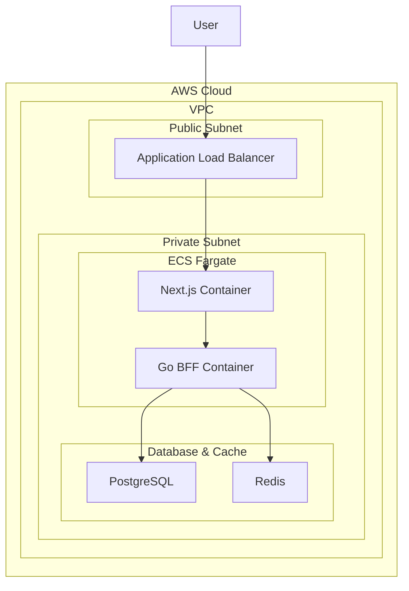

# Gravity V2 Hosting Recommendation

**Author**: Manus AI  
**Date**: January 1, 2026

## 1. Executive Summary

This document provides a comprehensive hosting recommendation for the Gravity V2 application, which consists of a Next.js frontend and a Go backend. The primary goal is to achieve **sub-100ms end-to-end response times** while maintaining cost-effectiveness, scalability, and operational simplicity.

Our recommendation is to adopt a **unified AWS deployment using ECS Fargate for both the frontend and backend**. This approach offers the best balance of performance, cost, and consistency, with potential cost savings of **70-90%** compared to popular PaaS solutions like Vercel [1].

## 2. Architecture Requirements

### Frontend (Next.js 16)
- **Framework**: Next.js 16 with App Router
- **Characteristics**: Moderately dynamic with real-time updates and personalized content
- **Key Technologies**: React 19, TypeScript, Tailwind CSS 4, Zustand, TanStack Query

### Backend (Go BFF)
- **Framework**: Go 1.21+ with Fiber
- **Characteristics**: Read-heavy, high-performance API with sub-100ms requirement
- **Key Technologies**: PostgreSQL, Redis, Container-based deployment

## 3. Hosting Options Analysis

We evaluated four hosting strategies based on performance, cost, scalability, and operational complexity.

| Option | Frontend | Backend | Est. Monthly Cost | Performance | Complexity | Verdict |
| :--- | :--- | :--- | :--- | :--- | :--- | :--- |
| 1. All-in-One PaaS | Vercel | Vercel (Serverless) | $500 - $2,000+ | Excellent | Low | ❌ Too Expensive |
| 2. **Unified AWS** | **AWS ECS Fargate** | **AWS ECS Fargate** | **$300 - $600** | **Excellent** | **Medium** | ✅ **Recommended** |
| 3. Hybrid PaaS/IaaS | Vercel | AWS ECS Fargate | $400 - $1,200 | Good | High | ⚠️ Complex & Costly |
| 4. Hybrid AWS | AWS Lambda | AWS ECS Fargate | $250 - $500 | Good | High | ⚠️ Complex Architecture |

## 4. Recommended Solution: Unified AWS ECS Fargate

We recommend deploying both the Next.js frontend and the Go backend as containerized applications on **AWS Elastic Container Service (ECS) with Fargate**.

### Architecture Overview

### Key Benefits

1. **Cost-Effectiveness**: This setup is significantly cheaper than Vercel, with estimates showing a **70-90% cost reduction** for moderately to highly dynamic applications [1] [2]. For a moderate traffic load of 20 requests per second, the estimated monthly cost is **$300-600**, compared to $1000-2000+ on Vercel.

2. **Performance**: Containerized hosting on ECS has been shown to match the performance of edge computing solutions like Vercel, especially when combined with a CDN like CloudFront [1]. With proper caching and resource allocation, sub-100ms response times are highly achievable.

3. **Operational Consistency**: Hosting both frontend and backend on the same platform simplifies infrastructure management, CI/CD pipelines, and monitoring. This reduces cognitive load and streamlines the development process.

4. **Scalability**: ECS Fargate allows for easy and automatic scaling of both frontend and backend services to meet demand. This is ideal for a growing application like Gravity V2.

5. **Security**: Deploying within a VPC provides a secure and controlled environment, which is crucial for enterprise-grade applications. This allows for proper network isolation and compliance with security best practices.

6. **Go Optimization**: This architecture is perfectly suited for the containerized Go backend, allowing for efficient resource utilization and consistent performance without the cold starts associated with serverless deployments.

## 5. Implementation Plan

1. **Containerize Frontend**: Create a multi-stage Dockerfile for the Next.js application.
2. **Infrastructure as Code**: Use Terraform to define all AWS resources (VPC, ECS, Fargate, ALB, PostgreSQL, Redis).
3. **CI/CD Pipeline**: Set up a GitHub Actions workflow to build and deploy both containers to ECS.
4. **CDN Configuration**: Configure CloudFront to cache static assets and route dynamic requests to the ALB.
5. **Monitoring**: Implement CloudWatch for logging, metrics, and alarms.

## 6. References

[1] Graphite. (2023, November 27). *Why we use AWS instead of Vercel to host our Next.js app*. https://graphite.com/blog/why-we-use-aws-instead-of-vercel

[2] Stacktape. (2024, August 9). *Next.js on AWS: comparing price and performance*. https://www.stacktape.com/blog/nextjs-price-performance-comparison-aws
